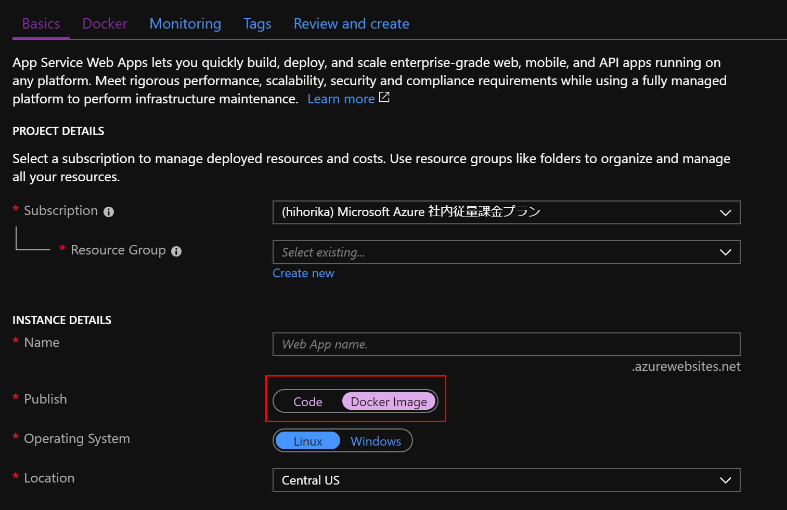
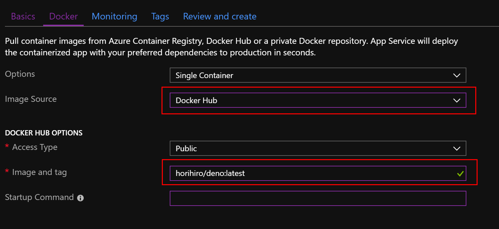
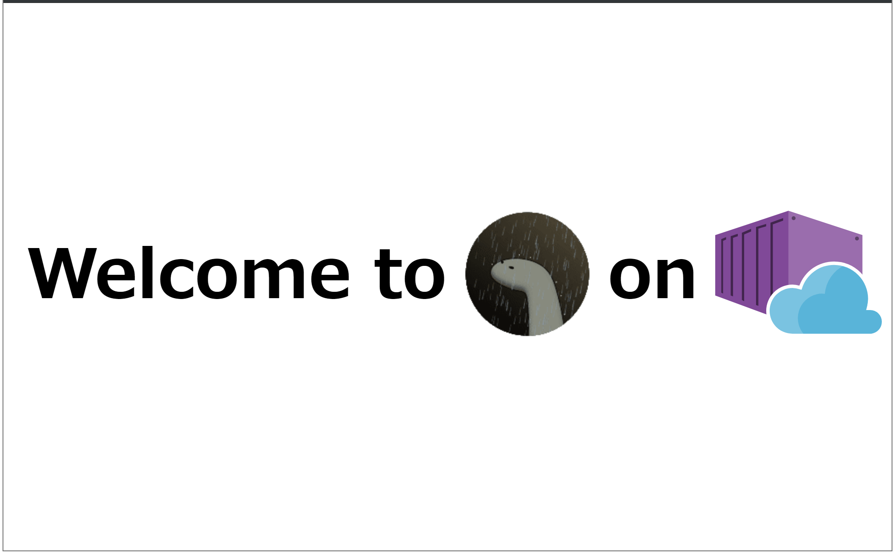
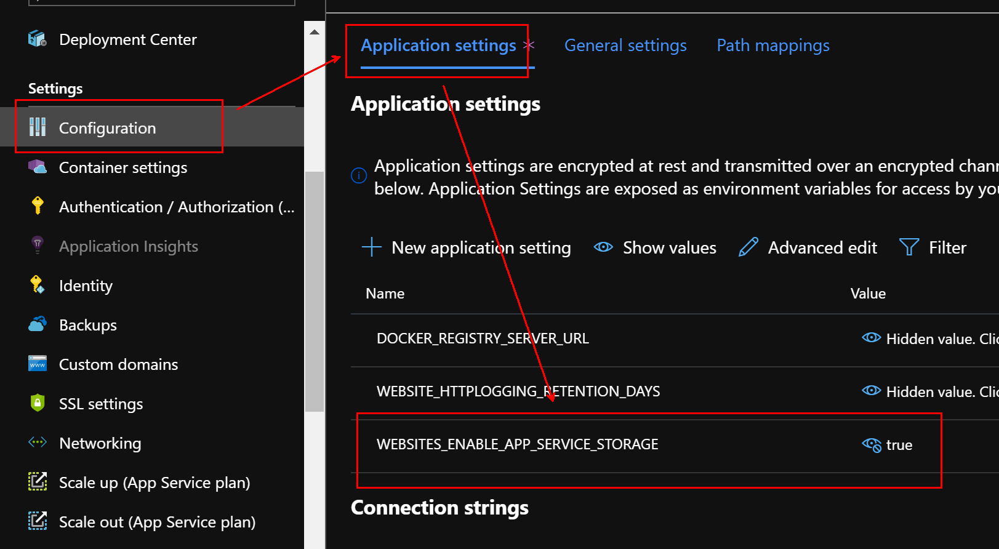
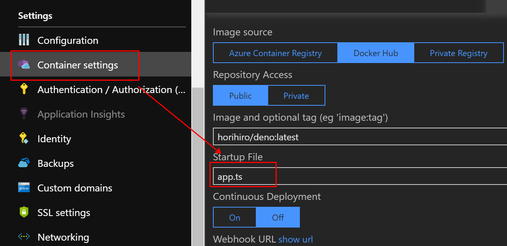
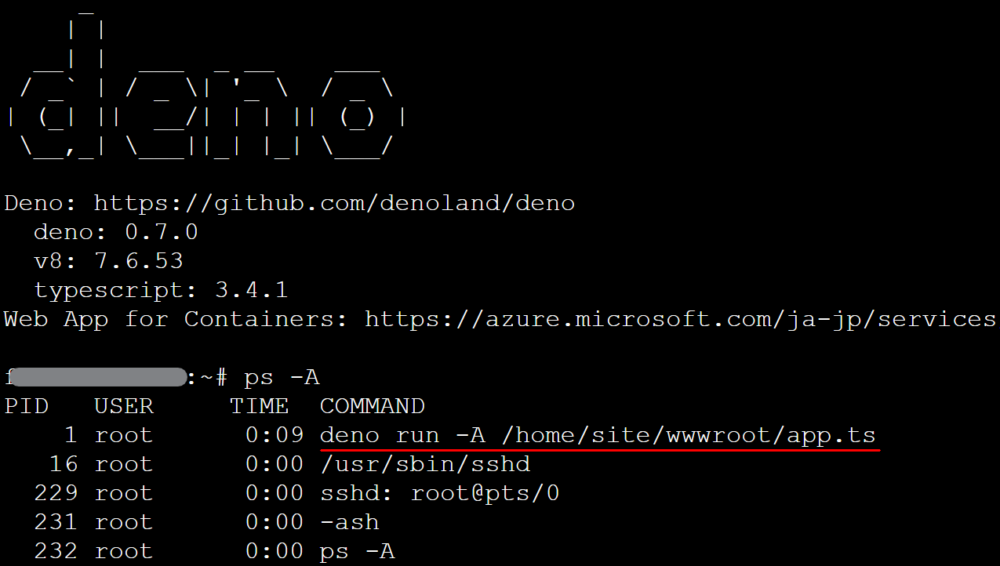

# Docker image for deno on Azure Web App for Containers
This docker file is  for [deno](https://github.com/denoland/deno/) on Azure Web App for Containers, based on [frol/docker-alpine-glibc
](https://github.com/frol/docker-alpine-glibc)

## Setup

1. Deploy new resource of Web App for Containers,<br>
   then set followings.
    - `Publish` to `Docker Image`<br>
  
    - `Image Source` to `Docker Hub`<br>
    and `Image and tag` to `horihiro/deno:latest`<br>
  
1. Open your Web App<br>
  url: https://\<your_webapp>.azurewebsites.net/
  
  And open webssh on your Web App<br>
  url: https://\<your_webapp>.scm.azurewebsites.net/webssh/host
  

## Usage

1. Set `WEBSITES_ENABLE_APP_SERVICE_STORAGE` in Configuration to `true`

1. Upload your .ts file on `/home/site/wwwroot` of your web app by using FTP, etc.
1. Set `Startup file` in the container settings to your .ts file you uploaded<br>
  
1. Restart and open your web app<br>
  Then following command runs.
    > deno run -A /home/site/wwwroot/app.ts
    
    

## Docker image hierarchy
```
scratch
  + alpine:3.8                             <-- alpine
      + frolvlad/alpine-glibc:alpine-3.8   <-- add glibc
          + THIS_IMAGE                     <-- add deno, sshd and handle startup
```

----

