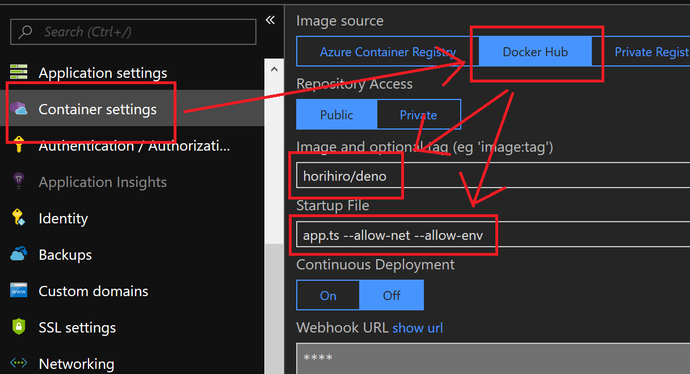

# Docker image for deno on Azure Web App for Containers
This docker file is  for [deno](https://github.com/denoland/deno/) on Azure Web App for Containers, based on [hayd/deno_docker](https://github.com/hayd/deno_docker) and [frol/docker-alpine-glibc
](https://github.com/frol/docker-alpine-glibc)

## Usage

0. Deploy new resource of Web App for Containers
1. Set the application settings `WEBSITES_ENABLE_APP_SERVICE_STORAGE` to `true`

2. Configure container settings <br>
    1. Set `Image and optional tag` to `horihiro/deno`
    1. Set `Startup File` to your .ts file and options<br>
       ( ex. `app.ts --allow-net --allow-env` )
  


## Docker image hierarchy
```
scratch
  + alpine:3.8
      + frolvlad/alpine-glibc:alpine-3.8
          + hayd/deno:alpine-0.2.5
              + THIS_IMAGE
```

----

