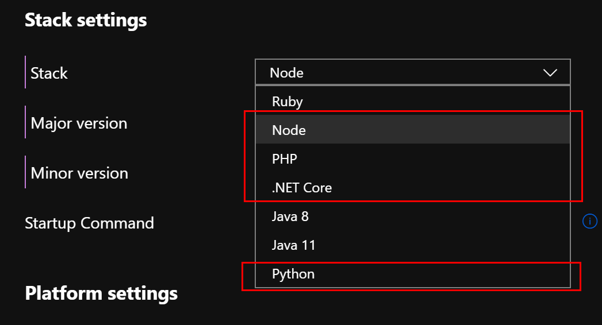
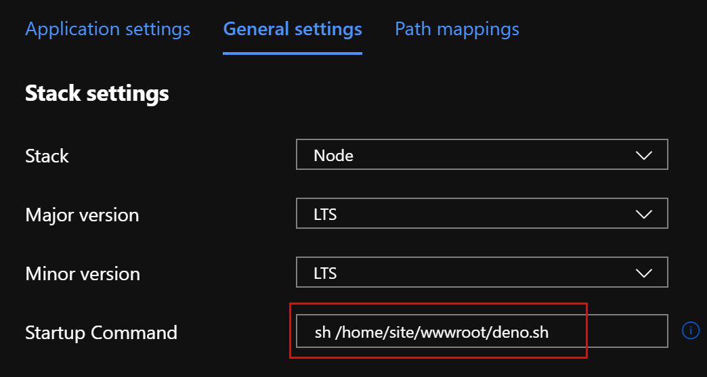
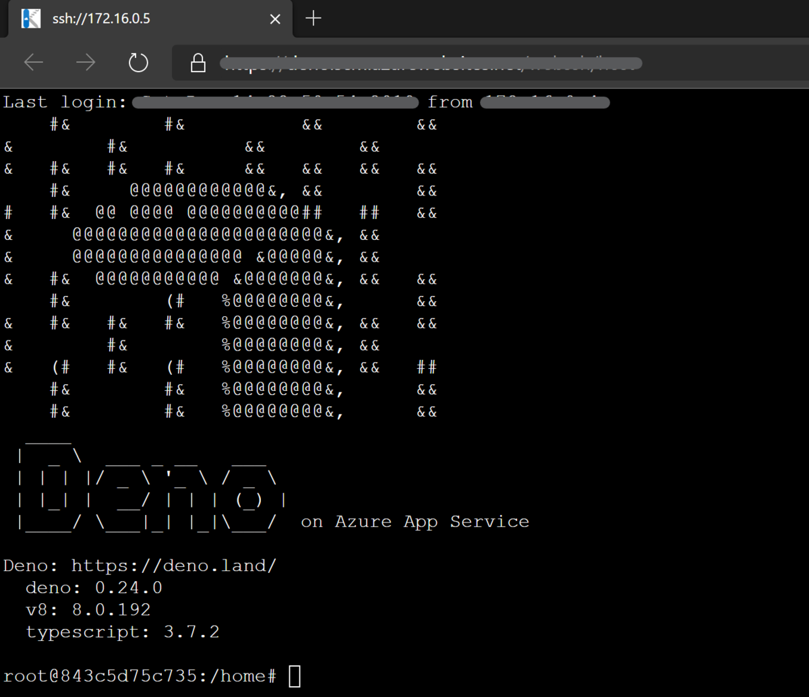

# How to run Deno for App Service on Linux

1. Select an application stack other than `Java` and `Ruby`
  
1. Upload [`deno.sh`](./deno.sh) and ts files to your WebApp via FTP etc.<br>
   The structure is following.
    ```
    /home/site/wwwroot
    |--deno.sh
    |--example.ts
    ```
1. Set `sh /PATH/TO/deno.sh` to `Startup Command` and save configurations
  

Then you can see the following screen when opening WebSSH.
  
